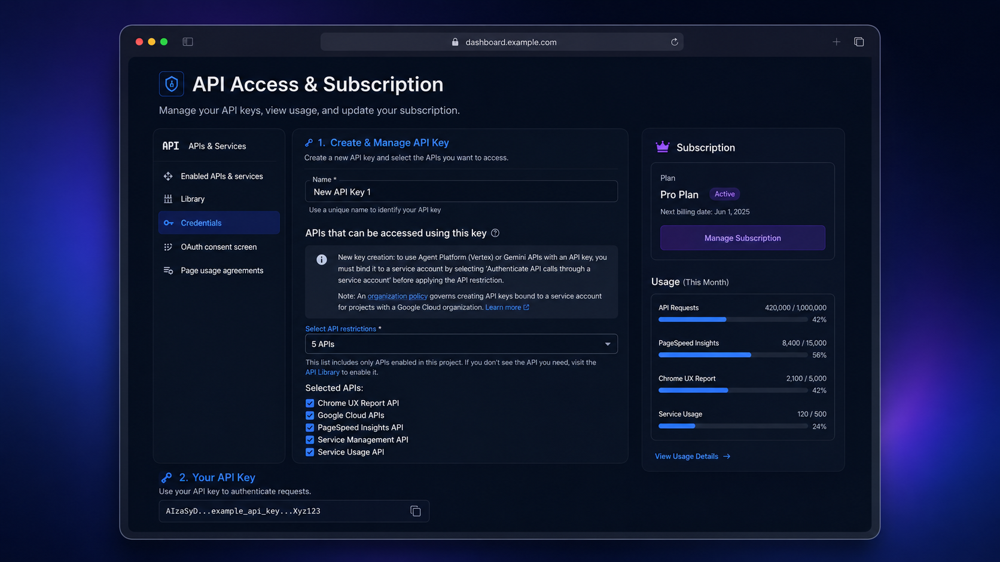

# PageSpeed Insights MCP Server

**19-tool MCP server** for Google PageSpeed Insights & Chrome UX Report APIs. Analyze, compare, and optimize web performance directly through Claude, Cursor, or any MCP-compatible AI client.

## ⚡ Quick Start (Copy & Paste)

```json
{
  "mcpServers": {
    "pagespeed-insights": {
      "command": "npx",
      "args": ["-y", "pagespeed-insights-mcp"],
      "env": { "GOOGLE_API_KEY": "your-google-api-key" }
    }
  }
}
```

Get a free API key at [Google Cloud Console](https://developers.google.com/speed/docs/insights/v5/get-started) → paste into Claude Desktop's `claude_desktop_config.json` → restart. Done. ([Codex/OpenAI config](#codex--openai), [Docker](#option-3-docker))

[](https://www.npmjs.com/package/pagespeed-insights-mcp)
[](https://www.npmjs.com/package/pagespeed-insights-mcp)
[](https://mcptoplist.com/server/io.github.ruslanlap%2Fpagespeed-insights-mcp)
[](https://glama.ai/mcp/servers/ruslanlap/pagespeed-insights-mcp)

<p align="center">
  
  
</p>

[](https://github.com/ruslanlap/pagespeed-insights-mcp/pkgs/npm/pagespeed-insights-mcp)
[](https://github.com/ruslanlap/pagespeed-insights-mcp/actions/workflows/ci.yml)
[](https://ruslanlap.github.io/pagespeed-insights-mcp/)
[](https://ruslanlap.github.io/pagespeed-insights-mcp/demo/)
[](https://opensource.org/licenses/Apache-2.0)

## 🔥 What Makes It Different

Most PageSpeed MCP servers wrap **one** tool: "run PSI on a URL." This server ships **19 tools** covering the full performance workflow — not just a score, but an action plan:

- **Full toolkit**: page analysis, CrUX real-user data (URL + origin), Lighthouse audits, multi-page & batch comparison, baselines, and regression tracking
- **Deep diagnostics**: element-level, network, JavaScript, image optimization, render-blocking, and third-party impact analysis
- **Actionable output**: a recommendations engine that turns raw Lighthouse data into prioritized fixes, plus visual analysis of screenshots
- **Practical extras**: caching for repeat runs and smart recommendations tuned for AI agents to act on
- **Battle-tested**: published on npm, listed in the [Official MCP Registry](https://registry.modelcontextprotocol.io/) and [Glama](https://glama.ai/mcp/servers), CI-tested with Vitest

> **🎬 [View Interactive Demo →](https://ruslanlap.github.io/pagespeed-insights-mcp/demo/)** — See the tools in action with animated examples
> Fallback URL: [https://ruslanlap.github.io/pagespeed-insights-mcp/demo.html](https://ruslanlap.github.io/pagespeed-insights-mcp/demo.html)

## 📖 Table of Contents

- [⚡ Quick Start (Copy & Paste)](#-quick-start-copy--paste)
- [🔥 What Makes It Different](#-what-makes-it-different)
- [⚙️ Client Configuration](#-client-configuration)
- [📊 Example Output](#-example-output)
- [📚 Documentation](#-documentation)
- [📝 Release Notes](#-release-notes)
- [🎯 Why You Need This](#-why-you-need-this)
- [✨ Features](#-features)
- [🚀 Quick Installation](#-quick-installation)
- [🔑 Getting Google API Key](#-getting-google-api-key)
- [⚙️ Claude Desktop Configuration](#-claude-desktop-configuration)
- [💻 Usage](#-usage)
- [Available Tools](#available-tools)
- [Development](#development)
- [Troubleshooting](#troubleshooting)
- [Requirements](#requirements)
- [Security](#security)
- [Acknowledgments](#acknowledgments)
- [License](#license)
- [Support](#support)

## ⚙️ Client Configuration

### Claude Desktop

Add to your `claude_desktop_config.json`:

```json
{
  "mcpServers": {
    "pagespeed-insights": {
      "command": "npx",
      "args": ["-y", "-p", "pino-pretty", "-p", "pagespeed-insights-mcp", "pagespeed-insights-mcp"],
      "env": {
        "GOOGLE_API_KEY": "your-google-api-key-here"
      }
    }
  }
}
```

### Codex / OpenAI

Add to your configuration (TOML):

```toml
[mcp_servers.pagespeed-insights]
command = "npx"
args = [
  "-y",
  "-p",
  "pino-pretty",
  "-p",
  "pagespeed-insights-mcp",
  "pagespeed-insights-mcp"
]
env = { GOOGLE_API_KEY = "your-google-api-key-here" }
```

> **Note:** The `pino-pretty` package is required for proper log formatting. The above configurations ensure it is installed automatically via `npx`.

### For Grok Build (config.toml)

Add to `~/.grok/config.toml` (global) or `<repo>/.grok/config.toml` (project-scoped, higher priority):

```toml
[mcp_servers.pagespeed-insights]
command = "npx"
args = ["-y", "-p", "pino-pretty", "-p", "pagespeed-insights-mcp", "pagespeed-insights-mcp"]
env = { GOOGLE_API_KEY = "${GOOGLE_API_KEY}" }
enabled = true

# Recommended companion professional MCPs (add once):
# [mcp_servers.github]      — PRs, issues, code search
# [mcp_servers.context7]    — fresh library docs (Upstash)
# [mcp_servers.serena]      — semantic code intelligence (uses your .serena/ if present)
```

**Project-scoped example** (put in this repo's `.grok/config.toml` for local `dist/index.js` + tighter Serena):

```toml
[mcp_servers.pagespeed-insights]
command = "node"
args = ["/home/ubuntuvm/Projects/pagespeed-insights-mcp/dist/index.js"]
env = { GOOGLE_API_KEY = "${GOOGLE_API_KEY}", NODE_ENV = "development" }
```

Verification inside Grok session:
- `/mcps` (or Ctrl+L → MCP tab) → ensure pagespeed-insights shows "running"
- Use tools: `pagespeed-insights__analyze_page`, `pagespeed-insights__get_crux_data` etc. (namespaced)

## 📊 Example Output

Real `analyze_page_speed` result for **github.com** (mobile, single run):

**Lighthouse lab scores:**

| Category | Score | Status |
|---|---|---|
| **Performance (mobile)** | **54/100** | 🔴 Poor |
| **Performance (desktop)** | **52/100** | 🔴 Poor |

**Core metrics (mobile):**

| Metric | Value | Rating |
|---|---|---|
| First Contentful Paint | 11.9 s | 🔴 Poor |
| Largest Contentful Paint | 13.4 s | 🔴 Poor |
| Total Blocking Time | 30 ms | 🟢 Excellent |
| Cumulative Layout Shift | 0.07 | 🟢 Good |
| Speed Index | 11.9 s | 🔴 Poor |

**CrUX field data — real users, github.com origin (phone):**

| Metric | p75 (real users) |
|---|---|
| First Contentful Paint | 1.9 s |
| Largest Contentful Paint | 2.2 s |
| Interaction to Next Paint | 243 ms |
| Cumulative Layout Shift | 0.02 |

> Lab vs field: Lighthouse throttles the connection (hence 54/100 mobile), while CrUX shows how actual GitHub visitors experience it — both views come straight from this server's tools.

## 📚 Documentation

We have comprehensive documentation available online.

[**👉 View Full Documentation Site**](https://ruslanlap.github.io/pagespeed-insights-mcp/)

- [🚀 **Getting Started**](https://ruslanlap.github.io/pagespeed-insights-mcp/getting-started/)
- [🛠️ **Tools Reference**](https://ruslanlap.github.io/pagespeed-insights-mcp/features/tools/)
- [🏗️ **Architecture**](https://ruslanlap.github.io/pagespeed-insights-mcp/developers/architecture/)

> You can also view the raw markdown files in the `docs/` directory or run `mkdocs serve` locally.

## 📝 Release Notes

Current release: **v1.7.0**.

Recent highlights:

- **v1.7.0** — baseline comparison (`compare_baseline`), progress keepalive, weighted findings, `strategy: both`
- **v1.6.0** — median-of-N analysis with replay dedup and lab-vs-field clarity
- **v1.5.x** — registry validation fixes, Dependabot guard hardening

> The badges at the top of this README update **automatically** on every release (npm version, GitHub package version, downloads). No manual edits needed.

For the complete release history, see [`CHANGELOG.md`](./CHANGELOG.md).

## 🎯 Why You Need This

**Pain point 1 — "My page is slow but I don't know why."**
You open PageSpeed Insights, get a wall of data, and still can't tell what to fix first. This MCP gives your AI assistant 19 specialized tools that cut through the noise: it identifies the exact render-blocking resources, the specific images wasting 2 MB, the third-party scripts eating 1.5 s of main-thread time — and ranks them by impact. Ask "why is my site slow?" and get a prioritized fix list, not a 40-metric dashboard.

**Pain point 2 — "I ship performance regressions to production."**
Your team moves fast, deploys daily, and nobody runs a full Lighthouse audit before each merge. By the time someone notices the Core Web Vitals dropped, the regression is already live. This MCP lets any developer paste a URL into Claude/Cursor and get a complete audit — lab data, field data from real Chrome users (CrUX), element-level CLS/LCP debugging — in seconds. It's the difference between catching a regression at your desk and discovering it in a Slack message from the SEO team three days later.

## ✨ Features

### Core Features

- 🚀 **Performance Analysis** of web pages using Google PageSpeed Insights
- 📱 **Multi-platform Support**: mobile and desktop devices
- 🔍 **Detailed Lighthouse Reports** with comprehensive metrics
- 📊 **Simplified Reports** with key performance indicators
- 🎯 **Smart Recommendations** with priority scoring and actionable fixes
- 💾 **Intelligent Caching** to reduce API calls and improve performance
- 🌍 **Localization** - support for multiple languages
- ⚡ **Quick Installation** - one command setup
- 🐳 **Docker Support** for containerized deployment

### Advanced Analysis Tools (New!)

- 📸 **Visual Analysis** - Screenshots, filmstrip, and full-page captures
- 🎯 **Element-Level Debugging** - Find specific DOM elements causing issues
- 🌐 **Network Waterfall** - Detailed request timing and resource loading
- ⚡ **JavaScript Profiling** - Execution breakdown and unused code detection
- 🖼️ **Image Optimization** - Specific image issues with exact savings
- 🚫 **Render-Blocking Analysis** - Critical request chains and dependencies
- 🔌 **Third-Party Impact** - Script impact grouped by provider
- 📊 **Full Audits** - Complete Lighthouse audits for all categories

## 🚀 Quick Installation

### Option 1: Automatic Installation (Recommended)

```bash
# Set environment variable
export GOOGLE_API_KEY=your-google-api-key
```

```bash
curl -sSL https://raw.githubusercontent.com/ruslanlap/pagespeed-insights-mcp/master/scripts/install.sh | bash
```

The installer uses the public npm package (`pagespeed-insights-mcp`) by default. To install the scoped GitHub Packages build instead, configure GitHub Packages authentication first and run:

```bash
curl -sSL https://raw.githubusercontent.com/ruslanlap/pagespeed-insights-mcp/master/scripts/install.sh | \
  PAGESPEED_INSIGHTS_MCP_PACKAGE=@ruslanlap/pagespeed-insights-mcp bash
```

### Option 2: Via npm or GitHub Packages

#### From npm (Public Registry)

```bash
# Global installation from npm
npm install -g pagespeed-insights-mcp

# Or use without installation
npx pagespeed-insights-mcp
```

#### From GitHub Packages

```bash
# First configure authentication (see GITHUB_PACKAGES.md for details)
# Then install globally
npm install -g @ruslanlap/pagespeed-insights-mcp
```

> **Note:** This package is available on both npm and GitHub Packages.
>
> - For npm: Use `npm install pagespeed-insights-mcp`
> - For GitHub Packages: Use `npm install @ruslanlap/pagespeed-insights-mcp` (requires GitHub authentication)
>
> For detailed instructions on installing from GitHub Packages, see [GITHUB_PACKAGES.md](GITHUB_PACKAGES.md) or visit the [GitHub Packages page](https://github.com/ruslanlap/pagespeed-insights-mcp/pkgs/npm/pagespeed-insights-mcp)

### 🔧 Configuration

The MCP server requires a Google API key to access the PageSpeed Insights API.

```bash
# Set environment variable
export GOOGLE_API_KEY=your-google-api-key

# Windows
$env:GOOGLE_API_KEY="your-google-api-key"

# Or pass directly when running
GOOGLE_API_KEY=your-google-api-key npx pagespeed-insights-mcp
```

### 📝 MCP Configuration Examples

#### For Claude Desktop (with pino-pretty logging):

```json
"pagespeed-insights": {
  "command": "npx",
  "args": [
    "-y",
    "-p",
    "pino-pretty",
    "-p",
    "pagespeed-insights-mcp",
    "pagespeed-insights-mcp"
  ],
  "env": {
    "GOOGLE_API_KEY": "your-google-api-key-here"
  }
}
```

#### For Codex (with pino-pretty logging):

```toml
[mcp_servers.pagespeed-insights]
command = "npx"
args = [
  "-y",
  "-p",
  "pino-pretty",
  "-p",
  "pagespeed-insights-mcp",
  "pagespeed-insights-mcp"
]
env = { GOOGLE_API_KEY = "your-google-api-key-here" }
```

> **Note:** These examples include `pino-pretty` for better log formatting. For production use without pretty logs, see the [Logging section](#logging--pino-pretty-in-mcp-environments) below.

### Google Antigravity

Example configuration files are available in the [examples](./examples/) directory.

### Option 3: Docker

```bash
docker build -t pagespeed-insights-mcp .
docker run -e GOOGLE_API_KEY=your-key pagespeed-insights-mcp
```

## 🔑 Getting Google API Key

To use this MCP server, you need a Google API key with the PageSpeed Insights API enabled.

> [!TIP]
> **⚡ Quick Setup Link:** You can go directly to the **[Google Cloud Credentials Setup Page](https://console.cloud.google.com/apis/credentials/key/)** to quickly create a key in your project.

### Step-by-Step Guide

1. Go to the [Google Cloud Console](https://console.cloud.google.com/) (or use the [Quick Setup Link](https://console.cloud.google.com/apis/credentials/key/)).
2. Create a new project or select an existing one.
3. Enable **PageSpeed Insights API**:
   - Navigate to **APIs & Services** → **Library**.
   - Search for **"PageSpeed Insights API"** and click **Enable**.
4. Create an API key:
   - Go to **APIs & Services** → **Credentials**.
   - Click **Create Credentials** → **API Key**.
   - Copy the generated key and set it as `GOOGLE_API_KEY` in your configuration.

<p align="center">
  
</p>


## ⚙️ Claude Desktop Configuration

Config paths: **macOS** `~/Library/Application Support/Claude/claude_desktop_config.json` · **Windows** `%APPDATA%\Claude\claude_desktop_config.json` · **Linux** `~/.config/claude/claude_desktop_config.json` — see [⚙️ Client Configuration](#️-client-configuration) above for the JSON. **Restart Claude Desktop** after editing.

## 💻 Usage

After configuration, simply ask Claude any of these commands:

### 🔍 Full page analysis

```
Analyze the performance of https://example.com
```

### 📱 Mobile device analysis

```
Analyze https://example.com for mobile devices with all categories
```

### ⚡ Quick performance overview

```
Get a quick performance report for https://example.com
```

### 🖥️ Desktop analysis

```
Analyze https://example.com performance for desktop devices
```

### 🌐 Multi-category analysis

```
Perform a full audit of https://example.com including SEO, accessibility, and best practices
```

### 🎯 Smart performance recommendations

```
Get smart recommendations for improving https://example.com performance
```

### 💾 Cache management

```
Clear the cache to get fresh data for all subsequent requests
```

### 📸 Visual analysis

```
Get visual analysis for https://example.com showing screenshots and loading timeline
```

### 🎯 Element-level debugging

```
Show me which specific elements are causing performance issues on https://example.com
```

### 🌐 Network waterfall analysis

```
Analyze the network requests and resource loading for https://example.com
```

### ⚡ JavaScript performance

```
Get JavaScript execution breakdown for https://example.com
```

### 🖼️ Image optimization opportunities

```
Show me which images need optimization on https://example.com
```

### 🚫 Render-blocking resources

```
Find render-blocking resources on https://example.com
```

### 🔌 Third-party script impact

```
Analyze third-party script impact on https://example.com performance
```

### 📊 Full Lighthouse audit

```
Run a full audit including accessibility, SEO, and best practices for https://example.com
```

## Available Tools

19 tools across three categories:

### Core Analysis

| Tool | Description |
|------|-------------|
| `analyze_page_speed` | Full Lighthouse analysis — all metrics and audits |
| `get_performance_summary` | Simplified key-metrics report |
| `get_recommendations` | Prioritized recommendations with actionable fixes |
| `full_report` | Unified report combining Lighthouse lab data with CrUX field data |
| `batch_analyze` | Analyze up to 10 URLs in parallel with progress tracking |
| `clear_cache` | Clear internal cache to force fresh API requests |

### CrUX & Comparison

| Tool | Description |
|------|-------------|
| `crux_summary` | Real-world Core Web Vitals from Chrome UX Report (field data) |
| `get_origin_crux` | Domain-level (origin) Chrome UX Report field data across all pages |
| `compare_pages` | Side-by-side performance comparison between two URLs |
| `compare_baseline` | Compare current run against a stored baseline to track regressions over time |

### Advanced Diagnostics

| Tool | Description |
|------|-------------|
| `get_visual_analysis` | Screenshots, filmstrip, and full-page captures |
| `get_element_analysis` | LCP/CLS DOM elements causing performance issues |
| `get_network_analysis` | Network waterfall — all requests with timing and size |
| `get_javascript_analysis` | JS bootup time, main-thread work, unused & duplicated modules |
| `get_image_optimization_details` | Images needing optimization with exact savings |
| `get_render_blocking_details` | Render-blocking resources and critical request chains |
| `get_third_party_impact` | Third-party script impact grouped by provider |
| `get_full_audit` | Complete Lighthouse audit for all categories |
| `get_performance_map` | Mermaid flowchart visualizing performance score, Core Web Vitals status, and top opportunities |

---

### `analyze_page_speed`

Complete page analysis with all Lighthouse metrics.

**Parameters:**

- `url` (required): URL of the page to analyze
- `strategy`: "mobile" or "desktop" (default: "mobile")
- `category`: array of categories ["performance", "accessibility", "best-practices", "seo", "pwa"]
- `locale`: locale for results (default: "en")
- `runs`: 1–5 distinct analyses (default: 1). With `runs > 1` the report shows the **median with min-max spread** for every score and metric, drops cached replays (identical `fetchTime`), and says how many it dropped. A single Lighthouse run is noise — TBT routinely swings 3× on an unchanged page, so treat differences inside the spread as no change. Note: Google re-analyses a URL about once a minute, so each extra run waits ~65 s to be genuinely distinct.
- `strategy`: also accepts `"both"` — runs mobile then desktop in one call and reports both.

### `get_performance_summary`

Simplified report with key performance metrics.

### `get_recommendations`

Generate smart performance recommendations with priority scoring and actionable fixes.

**Parameters:**

- `url` (required): URL of the page to analyze
- `strategy`: "mobile" or "desktop" (default: "mobile")
- `category`: array of categories to analyze (default: ["performance", "accessibility", "best-practices", "seo"])
- `locale`: locale for results (default: "en")

### `compare_baseline`

Answer "did that change actually help" — with statistical honesty.

- **First call** on a URL+strategy records the baseline (median + spread of `runs` distinct analyses, saved to `~/.pagespeed-mcp/baselines.json`) and compares nothing.
- Make your change, **call again**: a verdict is only given where the two min-max ranges do **not** overlap. On an unchanged page the performance score has been measured running 27–37 — comparing medians alone reports improvements that are just the instrument moving.
- Reports both the median difference and the smaller **guaranteed** figure the disjoint ranges actually give you. Quote the guaranteed one.
- Flags a Lighthouse version change between baseline and now, which moves scores without the page moving.

**Parameters:**

- `url` (required): URL to measure
- `strategy`: "mobile" or "desktop" (default: "mobile") — part of the baseline identity
- `runs`: 2–5 distinct analyses per side (default: 3, ~2 min)
- `save_baseline`: replace the baseline with this measurement (move the starting point; default: false)

### `clear_cache`

Clear the internal cache to force fresh API requests for all subsequent analyses.

### `get_visual_analysis`

Get screenshots and visual timeline showing how the page loads.

**Parameters:**

- `url` (required): URL of the page to analyze
- `strategy`: "mobile" or "desktop" (default: "mobile")

**Returns:**

- Final screenshot of the loaded page
- Filmstrip showing page load progression
- Full-page screenshot with DOM node mapping

### `get_element_analysis`

Get specific DOM elements causing performance issues.

**Parameters:**

- `url` (required): URL of the page to analyze
- `strategy`: "mobile" or "desktop" (default: "mobile")

**Returns:**

- LCP (Largest Contentful Paint) element details
- CLS (Cumulative Layout Shift) causing elements
- Lazy-loaded LCP warnings

### `get_network_analysis`

Get detailed network waterfall showing all requests with timing and size.

**Parameters:**

- `url` (required): URL of the page to analyze
- `strategy`: "mobile" or "desktop" (default: "mobile")

**Returns:**

- All network requests with timing data
- Resource breakdown by type
- Total transfer size and request count
- Network RTT and server latency

### `get_javascript_analysis`

Get JavaScript execution breakdown showing performance impact.

**Parameters:**

- `url` (required): URL of the page to analyze
- `strategy`: "mobile" or "desktop" (default: "mobile")

**Returns:**

- JavaScript bootup time by script
- Main thread work breakdown
- Unused JavaScript analysis
- Duplicated JavaScript modules

### `get_image_optimization_details`

Get specific images needing optimization with exact savings potential.

**Parameters:**

- `url` (required): URL of the page to analyze
- `strategy`: "mobile" or "desktop" (default: "mobile")

**Returns:**

- Improperly sized images
- Offscreen images (lazy-loading candidates)
- Unoptimized images
- Modern format recommendations (WebP/AVIF)

### `get_render_blocking_details`

Get render-blocking resources and critical request chains.

**Parameters:**

- `url` (required): URL of the page to analyze
- `strategy`: "mobile" or "desktop" (default: "mobile")

**Returns:**

- Render-blocking CSS and JavaScript files
- Critical request chains showing dependencies
- Total blocking time

### `get_third_party_impact`

Get third-party script impact analysis grouped by entity.

**Parameters:**

- `url` (required): URL of the page to analyze
- `strategy`: "mobile" or "desktop" (default: "mobile")

**Returns:**

- Impact by provider (Google, Facebook, etc.)
- Transfer size and blocking time per provider
- Recommended facade replacements

### `get_full_audit`

Get comprehensive audit results for all Lighthouse categories.

**Parameters:**

- `url` (required): URL of the page to analyze
- `strategy`: "mobile" or "desktop" (default: "mobile")
- `categories`: array of categories to audit (default: ["performance", "accessibility", "best-practices", "seo"])

**Returns:**

- Scores for all categories
- Detailed Core Web Vitals and metrics
- Key failing audits for each category
- Framework-specific advice (if applicable)

### `crux_summary`

Get real-world Core Web Vitals from the Chrome UX Report (field data from actual Chrome users).

**Parameters:**

- `url` (required): URL to analyze
- `formFactor`: "PHONE", "DESKTOP", or "TABLET" (default: "PHONE")

**Returns:**

- Real-world LCP, CLS, FID, INP, TTFB distributions
- Pass/fail thresholds per Core Web Vital
- Percentile breakdowns (p75)

### `compare_pages`

Compare performance metrics between two URLs side-by-side.

**Parameters:**

- `urlA` (required): First URL to compare
- `urlB` (required): Second URL to compare
- `strategy`: "mobile" or "desktop" (default: "mobile")

**Returns:**

- Side-by-side Lighthouse score comparison
- Metric-level diff for LCP, CLS, FCP, TBT, SI
- Winner/loser indication per metric

### `full_report`

Unified report combining Lighthouse lab data with CrUX real-world field data.

**Parameters:**

- `url` (required): URL to analyze
- `strategy`: "mobile" or "desktop" (default: "mobile")

**Returns:**

- Lighthouse lab scores + CrUX field data in one response
- Lab vs. field comparison for Core Web Vitals
- Actionable recommendations

### `batch_analyze`

Analyze performance for multiple URLs with progress tracking.

**Parameters:**

- `urls` (required): Array of URLs to analyze (max 10)
- `strategy`: "mobile" or "desktop" (default: "mobile")

**Returns:**

- Performance scores for all URLs
- Sorted ranking by score
- Per-URL metric breakdown

---

### Example

answer example from Claude Desktop with pagespeed-insights-mcp 🔥🔥🔥

## Development

For better log formatting during development, it is recommended to install `pino-pretty` globally:

```bash
npm install -g pino-pretty
```

```bash
# Development mode
npm run dev

# Build project
npm run build

# Run built server
npm start
```

### Logging / `pino-pretty` in MCP environments

This MCP server uses `pino` for logging and enables the `pino-pretty` transport when `NODE_ENV=development`.

- If you **just want it to work with minimal setup** (Claude, Codex, etc.), set:

```bash
NODE_ENV=production GOOGLE_API_KEY=your-google-api-key npx pagespeed-insights-mcp
```

or in your MCP config:

```jsonc
"pagespeed-insights": {
  "command": "npx",
  "args": ["pagespeed-insights-mcp"],
  "env": {
    "GOOGLE_API_KEY": "your-google-api-key-here",
    "NODE_ENV": "production"
  }
}
```

- If you **want pretty logs in development via `npx`**, you can have `npx` install `pino-pretty` alongside the server:

```jsonc
"pagespeed-insights": {
  "command": "npx",
  "args": [
    "-y",
    "-p",
    "pino-pretty",
    "-p",
    "pagespeed-insights-mcp",
    "pagespeed-insights-mcp"
  ],
  "env": {
    "GOOGLE_API_KEY": "your-google-api-key-here"
  }
}
```

## Troubleshooting

### "Google API key not provided"

Ensure the `GOOGLE_API_KEY` environment variable is set in your Claude Desktop configuration.

### "PageSpeed Insights API error: 403"

Check if PageSpeed Insights API is enabled in your Google Cloud project.

### "Invalid URL"

Ensure the URL includes the protocol — only `http://` and `https://` are accepted. Other schemes (`file://`, `ftp://`, `javascript:`, etc.) are rejected at the schema level.

## Requirements

- Node.js **20 or later** (Node 18 is EOL since April 2025 and is no longer supported).
- A Google API key with PageSpeed Insights and (optionally) Chrome UX Report APIs enabled.

## Security

Please report security issues privately — do **not** open a public issue. See [SECURITY.md](./SECURITY.md) for the disclosure policy and operator hardening notes.

## Acknowledgments

Special thanks to [@engmsaleh](https://github.com/engmsaleh) (Mohamed Saleh Zaied) for his significant contribution to the development of this project.

A very special thank you to [@system-conf](https://github.com/system-conf) for their outstanding and invaluable contribution to the growth and development of this project. Your dedication, expertise, and continuous support have made a tremendous impact — this project wouldn't be where it is today without you. 🙏

## License

Apache-2.0 — see [LICENSE](./LICENSE). Patents granted by contributors under the Apache License 2.0.

## Support

For bug reports or feature requests, please create an issue in the repository.
