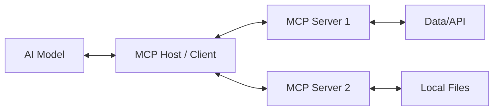

# What is MCP?

The **Model Context Protocol (MCP)** is an open standard that enables AI models to securely interact with local and remote resources. It provides a universal way to connect Large Language Models (LLMs) like Claude to data sources, tools, and prompts.

## The Problem

Previously, connecting an AI assistant to a new tool or dataset required building a custom integration for that specific AI application. If you wanted to use the same tool with a different AI, you had to rebuild the integration. This led to fragmented ecosystems and duplicated effort.

## The MCP Solution

MCP solves this by defining a standard protocol for:

1.  **Exposing Resources**: Letting the AI read data (files, database rows, API responses).
2.  **Providing Tools**: Letting the AI perform actions (run code, query APIs, update records).
3.  **Defining Prompts**: Providing reusable templates for common tasks.

## Architecture

MCP follows a client-server architecture:

*   **MCP Host**: The application where the AI lives (e.g., Claude Desktop, an IDE, or a custom AI app).
*   **MCP Client**: The component within the Host that speaks the protocol.
*   **MCP Server**: A standalone service that exposes specific capabilities (like this PageSpeed Insights server).

## How This Project Fits In

**PageSpeed Insights MCP** is an **MCP Server**.

*   It connects to the **Google PageSpeed Insights API**.
*   It translates the API's complex JSON responses into **Tools** that the AI can understand and use.
*   It runs locally on your machine (or in a container) and communicates with your AI assistant (like Claude) via standard input/output (stdio).

When you ask Claude to "Analyze example.com", Claude doesn't know how to talk to Google's API directly. Instead, it sends a request to this MCP server via the protocol. The server handles the API call, processes the data, and returns a structured result that Claude can interpret and explain to you.
