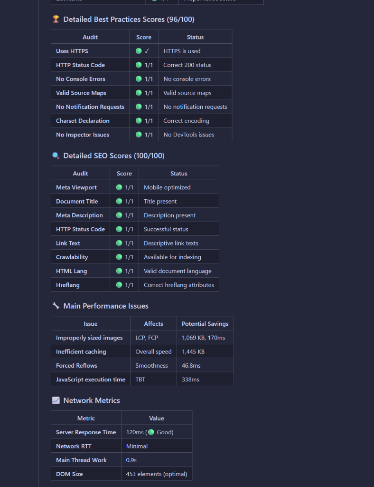

# Getting Started

This guide will help you set up the PageSpeed Insights MCP server and connect it to your MCP client (like Claude Desktop).

## Prerequisites

Before you begin, ensure you have the following:

1.  **Node.js**: Version 18 or higher.
2.  **Google API Key**: Required to access the PageSpeed Insights API.

### Obtaining a Google API Key

1.  Go to the [Google Cloud Console](https://console.cloud.google.com/).
2.  Create a new project or select an existing one.
3.  Navigate to **APIs & Services** > **Library**.
4.  Search for "PageSpeed Insights API" and enable it.
5.  Go to **APIs & Services** > **Credentials**.
6.  Click **Create Credentials** > **API Key**.
7.  Copy the generated key.

## Installation

You can run the server using `npx` (recommended), install it globally via `npm`, or use Docker.

### Option 1: Using `npx` (Recommended)

You can run the server directly without installation:

```bash
export GOOGLE_API_KEY=your-google-api-key
npx pagespeed-insights-mcp
```

### Option 2: Global Installation

Install the package globally using npm:

```bash
npm install -g pagespeed-insights-mcp
```

Then run it:

```bash
export GOOGLE_API_KEY=your-google-api-key
pagespeed-insights-mcp
```

### Option 3: Docker

Build and run the container:

```bash
docker build -t pagespeed-insights-mcp .
docker run -e GOOGLE_API_KEY=your-key pagespeed-insights-mcp
```

## Configuration

The server requires the `GOOGLE_API_KEY` environment variable.

| Variable | Description | Required | Default |
| :--- | :--- | :--- | :--- |
| `GOOGLE_API_KEY` | Your Google PageSpeed Insights API Key | Yes | - |
| `LOG_LEVEL` | Logging level (trace, debug, info, warn, error) | No | `info` |
| `MAX_CONCURRENCY` | Max concurrent requests | No | `3` |
| `REQUEST_TIMEOUT` | Request timeout in ms | No | `30000` |
| `CACHE_TTL` | Cache time-to-live in seconds | No | `3600` |

## Connecting to Claude Desktop

To use this server with Claude Desktop, you need to configure the `claude_desktop_config.json` file.

**File Location:**

*   **macOS**: `~/Library/Application Support/Claude/claude_desktop_config.json`
*   **Windows**: `%APPDATA%\Claude\claude_desktop_config.json`
*   **Linux**: `~/.config/claude/claude_desktop_config.json`

**Configuration:**

Add the following to your configuration file:

```json
{
  "mcpServers": {
    "pagespeed-insights": {
      "command": "npx",
      "args": [
        "-y",
        "pagespeed-insights-mcp"
      ],
      "env": {
        "GOOGLE_API_KEY": "your-google-api-key-here"
      }
    }
  }
}
```

!!! tip "Windows Users"
    If you are on Windows, make sure to use the full path to the executable if `npx` is not in your PATH, or use the Docker method.

After updating the configuration, restart Claude Desktop. You should now see the PageSpeed tools available in the interface.

## Usage Examples

Once connected, you will see a list of available tools in your MCP client.


You can ask Claude to analyze a website, and it will use these tools to provide a comprehensive report.


